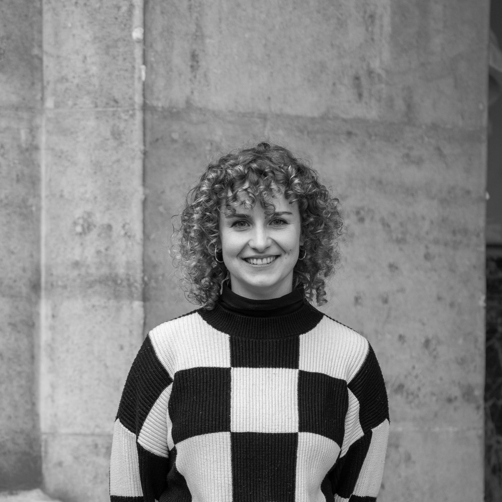

Hi! My name is Jula. I work as a PhD student in the [Computational Communication Science Lab](https://compcommlab.univie.ac.at/) at the University of Vienna, but I am also affiliated with the [Complexity Science Hub](https://csh.ac.at/) as a Junior Fellow.
Overall, I wonder how groups of people belonging to the same society can have diverging understandings of reality and particularly, why. 
Generally, I use a combination of methods to approach this problem, but I am especially interested in using social media as a data source to study human behavior. For my current project, I am studying the spread of misinformation on social media and the impact of emotions on this phenomenon (read more about the project in the [research section](/research/)).

I am a social scientist by training and I am particularly interested in the intersection of social science and computer science.
My educational background is (political) communication science and polito-linguistics. I received my M.Sc. in Communication Science from the University of Amsterdam and my B.A. in German Language from the University of Bremen (with German studies as a major and Communication Science as a minor). Initially, I was interested in qualitative research and content analysis. However, during my Masters at ASCoR, I felt like there are some phenomena that should be studied *in the wild*. For instance, to study social behavior online, we can use social media as a data source.

Currently, I am learning **a lot** about machine learning and working efficiently with huge amounts of data. I am trying to decide if I am a Python or R person, but I am not there yet. I am always curious to see what other disciplines are up to. I am also passionate about open science and I always looking for ways to make my research more transparent and reproducible. 

Hit me up if you are interested in collaboration, have a question, or just want to chat about research, social media, or R vs Python!!

